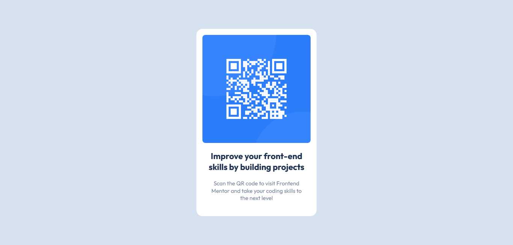

# Frontend Mentor - QR code component solution

This is a solution to the [QR code component challenge on Frontend Mentor](https://www.frontendmentor.io/challenges/qr-code-component-iux_sIO_H).

## Screenshot

## My Process

### Built with

-   Semantic HTML5 markup
-   CSS custom properties
-   CSS Grid (to place the card in the center of the screen)
-   [CSS reset by Josh W Comeau](https://www.joshwcomeau.com/css/custom-css-reset/)

### What I learned

Not much. I learned most of the properties needed over at [codecademy](https://www.codecademy.com/). But I do find it interesting that setting a `max-width: 100%` on an image makes it more responsive. For some reason I expected it to be responsive by default.
